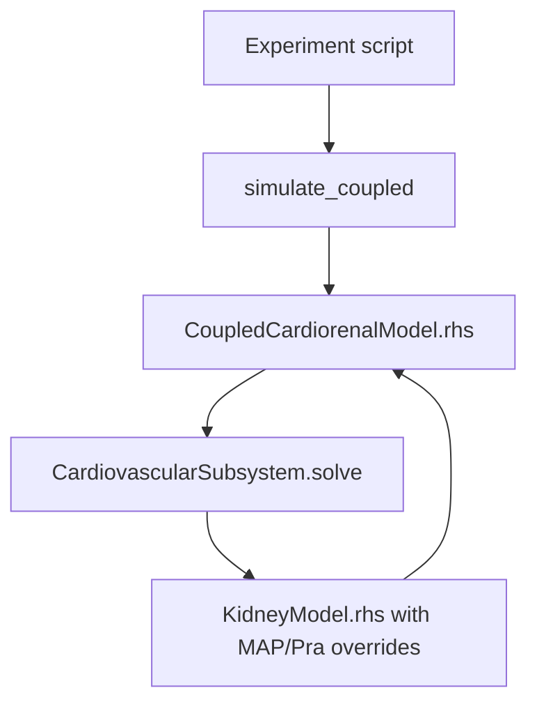

# Code Walkthrough and Modification Guide

## 1. How to use this guide

This guide is written for someone who is still becoming comfortable with
Python. It explains where each equation lives, how data move through the model,
and exactly what kind of change is needed for common experiments.

Use this rule:

> Change an **input** to simulate an intervention. Change a **parameter** to
> change a mechanism's strength. Change an **equation** only when adding or
> replacing physiology. Recalculate equilibrium after parameter/equation
> changes; recalibrate only when quantitative target agreement is required.

## 2. Before making a change

1. Keep an unchanged copy or create a Git branch.
2. Run:

   ```bash
   python run_coupled_checks.py
   python -m unittest discover -s tests -v
   ```

3. Save the current output as a control.
4. Write down the proposed equation, units, source, reference value, and
   expected direction of effect.
5. Decide whether the change is an input, parameter, algebraic variable, or
   dynamic state.

## 3. What happens when a coupled script runs

For example, `python run_coupled_double_sodium.py` does the following:

1. creates a baseline sodium function and a day-2 step function;
2. selects `hallow_table3_calibrated_cardiorenal_parameters()`;
3. loads `hallow_table3_reference_equilibrium_state()`;
4. constructs a `CoupledCardiorenalModel` for control and intervention;
5. calls the stiff BDF solver;
6. at every solver evaluation, solves the cardiovascular algebraic loop;
7. passes calculated MAP and `P_ra` into the kidney;
8. solves the renal glomerular-pressure algebraic loop;
9. returns 15 state derivatives;
10. recalculates diagnostic outputs on the requested time grid;
11. saves CSV files and a comparison figure.

The following topology is the important part:



## 4. File-by-file explanation

Line numbers change as the project evolves. Search for the class, function, or
parameter name shown below.

### 4.1 `hallow_cardiorenal/parameters.py`

This file defines two immutable parameter bundles.

- `CardiovascularParameters` contains every heart/vascular number.
- `CardiorenalParameters` joins one kidney bundle to one cardiovascular
  bundle.
- the four constructor functions create named scientific configurations.

Important fields:

- `closure_mode`: `baseline_centered` or `published_literal`;
- `pra_scale_mmHg` and `pra_flow_coefficient_min_per_L`: printed exponential
  `P_ra(CO)` curve;
- `cardiac_output_ref_L_per_min=5.0` and `p_ra_ref_mmHg=0.0`: centering point;
- `vascularity_destruction_per_min=1e-5`: slow vascular adaptation;
- `arterial_resistance_constant_mmHg_min_per_L=16.6`;
- `basic_venous_resistance_mmHg_min_per_L=3.4`.

Properties such as `p_ra_raw_reference_mmHg` and
`mean_filling_pressure_reference_shift_mmHg` calculate reconciliation values
from primary parameters. Do not copy their numbers into a second location.

### 4.2 `hallow_cardiorenal/inputs.py`

`CardiorenalInputs` contains only signals that remain external after coupling:

- sodium intake;
- optional peritubular pressure.

MAP and `P_ra` are intentionally absent. Adding them here would reopen the
closed cardiovascular loop.

### 4.3 `hallow_cardiorenal/states.py`

This file appends `vascularity` to the 14 kidney states and stores three useful
starting vectors:

- `initial_state`: nominal paper/agreed state;
- `cvp_reference_equilibrium_state`: full equilibrium for CVP enabled;
- `corrected_hallow_reference_equilibrium_state`: full equilibrium for CVP off.

`split_state` protects the exact ordering. If a new state is added, update
`STATE_NAMES`, the initial state, the derivative vector, equilibrium scaling,
tests, and documentation together.

### 4.4 `hallow_cardiorenal/cardiovascular.py`

`CardiovascularSubsystem.blood_volume_L` implements the sigmoid mapping from
ECF volume to blood volume.

`_values_at_pressure` evaluates every cardiovascular equation for one
candidate MAP:

1. calls the kidney's autonomic calculation to obtain `epsilon_aum`;
2. calculates blood volume;
3. calculates arterial and total peripheral resistance;
4. obtains `CO=MAP/R_tp`;
5. calculates raw and selected `P_ra`;
6. calculates mean filling pressure;
7. calculates venous-return resistance and venous return;
8. returns the residual `CO - venous_return`.

`solve` finds the MAP for which that residual is zero. It then calculates
vascularity formation, destruction, and derivative.

Do not calculate cardiac output once from a guessed MAP and reuse it. MAP,
autonomic tone, resistance, cardiac output, and venous return form an implicit
algebraic loop.

### 4.5 `hallow_cardiorenal/model.py`

`CoupledCardiorenalModel.__init__` builds the kidney with placeholder reference
pressures. Those placeholders are overwritten during every coupled evaluation;
they exist only to satisfy the reusable standalone interface.

`_coupling_values` sends `V_ECF`, vascularity, and the baroreceptor integral to
the cardiovascular solver.

`algebraic_outputs`:

1. splits the 15-state vector;
2. solves cardiovascular outputs;
3. calls kidney outputs with calculated MAP and `P_ra` overrides;
4. merges both diagnostic dictionaries.

`rhs` repeats the same coupling, obtains the 14 kidney derivatives, and appends
`d_vascularity/dt`.

### 4.6 `hallow_cardiorenal/simulation.py`

`simulate_coupled` uses SciPy `solve_ivp`. Default method is BDF because the
RAAS half-lives, hormone adaptation, vascularity, and volume dynamics occupy
very different time scales.

Arguments you may change safely in an experiment script:

- `days`: simulated duration;
- `samples_per_day`: output resolution, not solver step size;
- `method`: `BDF` or `Radau`;
- `relative_tolerance` and `absolute_tolerance`: numerical accuracy;
- `y0`: starting state.

### 4.7 `hallow_cardiorenal/steady_state.py`

`calculate_coupled_equilibrium` first integrates for a settling interval and
then calls `refine_coupled_equilibrium`.

Positive states are optimized in logarithmic coordinates. The two adaptation
integrals remain unbounded because they may be negative. State derivatives are
scaled so large-number AGT dynamics do not dominate small hormone/vascularity
dynamics.

### 4.8 `hallow_cardiorenal/validation.py`

This file checks:

- cardiac output equals venous return;
- nominal MAP, `P_ra`, and cardiac output are preserved in centered mode;
- vascularity is balanced at the nominal centered reference;
- the CVP-Bowman term is neutral at its reference;
- nominal RAAS peptides match the isolated analytical equilibrium;
- all outputs are finite;
- a supplied coupled equilibrium has zero derivatives and exact sodium/water
  balance.

### 4.9 `hallow_cardiorenal/plotting.py`

This file contains standard coupled, comparison, and RIHP figures. Add plots
here instead of embedding repeated plotting code in every experiment script.

### 4.10 `hallow_kidney/parameters.py`

This remains the main location for renal, RAAS, tubular, hormone, CVP, and RIHP
constants. Search for:

- `r_aa_0_mmHg_min_per_L_per_nephron = 6.0e7`;
- `r_ea_0_mmHg_min_per_L_per_nephron = 1.0e8`;
- `n_rs_pg_per_mL_per_min = 97.0/60.0`;
- `k_baro_per_min = 0.0000667`;
- `p_b_cvp_slope = 0.1468`;
- `s_pn_pt`, `s_pn_dt`, and `s_pn_cd = 3.0`.

### 4.11 `hallow_kidney/model.py`

Major blocks appear in this order:

1. input collection and pressure overrides;
2. autonomic, baroreceptor, RSNA, and local ADH clamp;
3. concentrations and CVP/RIHP calculations;
4. AT1 vascular multipliers;
5. implicit renal hemodynamics, GFR, proximal transport, and TGF;
6. distal and collecting-duct sodium transport;
7. water intake/excretion;
8. aldosterone, ADH, and renin stimuli;
9. 14 ODE derivatives.

The CVP term is computed before GFR:

```python
p_b_cvp = (
    p.p_b_cvp_slope * (p_ra - p.p_ra_ref_mmHg)
    if p.enable_cvp_bowman
    else 0.0
)
p_b_total = p.p_b_tubular_mmHg + p_b_cvp
```

It then enters net filtration pressure:

```python
net_filtration_pressure = p_gh_mmHg - p_b_total - p.p_go_mmHg
```

## 5. Common experiment: double sodium intake

Open `run_coupled_double_sodium.py`. The intervention is defined here:

```python
sodium_intake_mEq_per_min=step_input(
    baseline=0.126,
    changed=0.252,
    start_min=2.0 * 1440.0,
)
```

Change only these three numbers:

- `baseline`: starting intake;
- `changed`: intake after the step;
- `start_min`: day of intervention multiplied by 1440.

Examples:

```python
# Threefold sodium from day 5
baseline=0.126,
changed=0.378,
start_min=5.0 * 1440.0,
```

```python
# Low sodium from day 2 through day 12, then return to baseline
sodium_intake_mEq_per_min=step_input(
    baseline=0.126,
    changed=0.063,
    start_min=2.0 * 1440.0,
    end_min=12.0 * 1440.0,
)
```

An input change does **not** require recalibrating the model. It requires a
matched control, sufficient simulation duration, and a sensitivity/uncertainty
analysis if quantitative predictions will be claimed.

## 6. Change the CVP-Bowman slope without editing defaults

Use immutable `replace` to create an explicit variant:

```python
from dataclasses import replace
from hallow_cardiorenal import cvp_extended_cardiorenal_parameters

base = cvp_extended_cardiorenal_parameters()
changed_kidney = replace(base.kidney, p_b_cvp_slope=0.20)
changed_parameters = replace(
    base,
    configuration_name="cvp_slope_0p20",
    kidney=changed_kidney,
)
```

Because the slope is reference-centered, the nominal `P_ra=0` state is still
neutral. Nevertheless, changing the slope changes the full equilibrium when
the equilibrium `P_ra` is not exactly zero. Recalculate the equilibrium before
running chronic comparisons.

Do not edit `0.1468` for the current novelty if that value is fixed by the
experimental relationship. Use parameter variants only for sensitivity or
uncertainty analysis and label them clearly.

## 7. Turn the novelty off

Use the named constructor:

```python
from hallow_cardiorenal import corrected_hallow_cardiorenal_parameters

parameters = corrected_hallow_cardiorenal_parameters()
```

Start from `corrected_hallow_reference_equilibrium_state()`, not the CVP-enabled
equilibrium.

## 8. Compare with the cardiovascular equations exactly as printed

Use:

```python
from hallow_cardiorenal import published_literal_cardiorenal_parameters
```

or run:

```bash
python run_published_cardiovascular_comparison.py
```

Literal mode is an audit configuration. It intentionally does not force
`MAP=100`, `P_ra=0`, `CO=5`, or `dvascularity/dt=0` at the nominal state.

## 9. RIHP example already implemented

The current provisional algebraic relation is

\[
\Delta\mathrm{RIHP}=P_{peritubular}-P_{peritubular,ref},
\]

\[
\gamma_{rihp,i}=1+S_{P-N,i}
\left[\frac{1}{1+\exp(\Delta\mathrm{RIHP}/1\ \mathrm{mmHg})}-0.5\right],
\qquad S_{P-N,i}=3.
\]

It is applied to proximal, distal, and collecting-duct fractional sodium
reabsorption. Run:

```bash
python run_coupled_rihp_example.py
```

A `+0.1 mmHg` step yields approximately `gamma=0.925062` in all three segments.
The small step is deliberate: `S=3` is provisional, and the logistic can
otherwise produce a very large transport change.

### Does this RIHP equation need a new ODE state?

No. As written, RIHP is algebraically equal to a pressure difference, so it is
recomputed instantaneously. It would become a state only if you add a dynamic
law such as

\[
\tau_{RIHP}\frac{dRIHP}{dt}=RIHP_{target}-RIHP.
\]

That extension would require a time constant, initial condition, new state,
new derivative, equilibrium recalculation, and calibration data.

### Does adding RIHP require recalibration?

- To test the qualitative hypothesis: not necessarily. Use an enabled/disabled
  comparison, reference neutrality, sensitivity analysis, and recalculate each
  equilibrium.
- To make quantitative claims about sodium excretion or MAP: yes, estimate the
  segment sensitivities and pressure scale from data. The three segments are
  unlikely to be independently identifiable from urinary sodium alone.
- Recalibrating the entire model immediately is usually unjustified. First fit
  only the new RIHP parameters and inspect residuals. Expand calibration only
  when existing parameters demonstrably need adjustment.

## 10. Add renal venous pressure to renal blood flow

The current source-reproduction path is inside the kidney function
`renal_values`:

```python
phi_renal_blood = p_ma / r_renal
```

A new hypothesis could instead use:

```python
p_renal_venous = p_ra
phi_renal_blood = (p_ma - p_renal_venous) / r_renal
```

Do not replace the default silently. Add a parameter switch such as
`enable_renal_venous_perfusion_pressure`, create a new named configuration, and
return `p_renal_venous_mmHg` as a diagnostic output.

The vascular-perfusion and Bowman/interstitial pathways are physically
distinct, so including both is not algebraically double counting. It can be
**empirically** double counting if the fitted `P_B,CVP` relation already embeds
the total observed renal effect of elevated CVP. Resolve this by fitting both
mechanisms to data that separately constrain renal blood flow and filtration or
interstitial pressure.

## 11. Add a new cardiovascular mechanism

### Example: altered systemic resistance

If the mechanism modifies the strength of arterial resistance, add a named
parameter to `CardiovascularParameters`, multiply it in
`_values_at_pressure`, and create an explicit constructor. Recalculate the
equilibrium and add a direct test showing the expected direction of MAP and CO.

### Example: reduced cardiac pump function

The present equations enforce `CO=venous return`; they have no independent pump
capacity. Do not mimic heart failure by arbitrarily changing `P_ra_scale`.
Introduce a documented pump relation, its parameters/states, and data. Depending
on the chosen model, the algebraic residual may become:

\[
CO_{pump}(P_{ra},\text{contractility})-VR(P_{ra})=0.
\]

That is a major structural extension and requires broad revalidation.

## 12. Add another ODE state

Suppose RIHP becomes dynamic. Make all of these changes:

1. add `rihp_mmHg` to `STATE_NAMES`;
2. add its initial value to every relevant starting vector;
3. update `split_state` or the kidney state interface;
4. calculate `d_rihp/dt` in the owning subsystem;
5. append the derivative in the same order;
6. add a positive/free-state decision to equilibrium refinement;
7. add the derivative scale;
8. update plots, CSV expectations, tests, and parameter documentation;
9. recalculate every stored equilibrium.

A mismatch between state ordering and derivative ordering can produce plausible
but completely wrong simulations. The shape checks in the code catch only some
of these errors; a direct state-derivative unit test is still required.

## 13. When equilibrium must be recalculated

| Change | Recalculate equilibrium? | Recalibrate parameters? |
|---|---:|---:|
| Sodium step timing or size | No for the starting baseline | No |
| Simulation duration/output resolution | No | No |
| Numerical tolerance | No, but compare results | No |
| CVP slope | Yes | Only for quantitative target fitting |
| Enable/disable CVP-Bowman | Use the matching supplied equilibrium | Not automatically |
| Enable RIHP with reference-neutral input | Baseline is mathematically unchanged, but verify | New RIHP parameters need data for prediction |
| Add renal venous perfusion pressure | Yes | Likely targeted calibration |
| Add a new ODE state | Yes | Usually |
| Change nephron number or renal resistance | Yes | Depends on scientific purpose |
| Change RAAS kinetic rates | Yes | Yes for predictive use |
| Replace the cardiac closure | Yes | Yes |

Recalculation means solving the existing equations for zero derivatives.
Recalibration means estimating parameters against data. They are not synonyms.

## 14. Recalculate the full equilibrium

After changing a parameter/equation, edit the constructor used in
`calculate_coupled_equilibrium.py`, then run:

```bash
python calculate_coupled_equilibrium.py
```

The script prints:

- nonlinear solver success;
- maximum scaled residual;
- maximum unscaled derivative;
- all 15 state values;
- key cardiovascular and renal outputs.

Do not paste a new state into `states.py` until all derivatives, sodium balance,
and water balance pass. Name the equilibrium after its exact configuration.

## 15. Add tests for a new mechanism

Each new term should have at least four tests:

1. **reference neutrality:** new multiplier/pressure equals its baseline value;
2. **direction:** increasing its driver changes the immediate target output in
   the expected direction;
3. **isolation:** disabling the mechanism reproduces the previous equations;
4. **integration:** a short stiff simulation remains finite.

For a chronic mechanism also add:

5. whole-system equilibrium residual;
6. BDF/Radau agreement;
7. enabled-versus-disabled protocol comparison from matching equilibria.

## 16. Interpreting outputs safely

- A solver success message means numerical integration succeeded, not that the
  physiology is validated.
- A zero-derivative state means mathematical equilibrium, not necessarily a
  healthy-human baseline.
- A reference-centered equation is a documented reconciliation, not a literal
  transcription.
- A very small CVP-Bowman effect during the sodium example is expected because
  this closure produces only a small `P_ra` rise. It does not invalidate the
  fixed slope.
- The current equilibrium reaches the urine-flow floor. Water-balance behavior
  near that floor should not be used for strong quantitative claims without
  recalibration or structural review.
