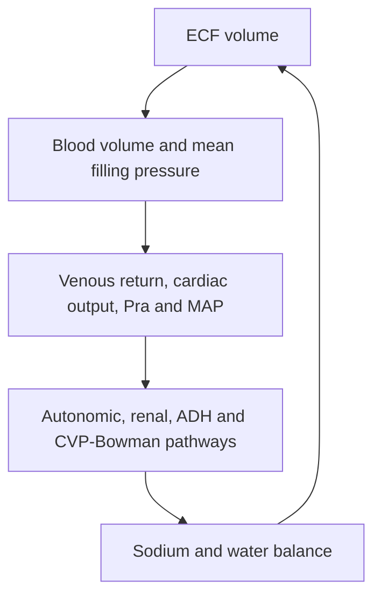

# Coupled Hallow/Karaaslan Cardiorenal Model

The default `run_coupled_baseline.py` now uses the separately named Hallow
Table 3 calibration.  It produces MAP `83 mmHg`, positive `P_ra=0.902 mmHg`,
cardiac output `5.15 L/min`, GFR `99 mL/min`, renal blood flow `0.9 L/min`, and
total Bowman pressure `18 mmHg` at exact sodium and water balance.  See
[`CALIBRATION_REPORT.md`](CALIBRATION_REPORT.md) for targets, parameter changes,
source inconsistencies, derivations, and limitations.  The original
source-reproduction configurations remain available unchanged.

This project connects the corrected Hallow kidney/RAAS implementation to the
long-term Karaaslan/Hallow cardiovascular closure. Mean arterial pressure
(`P_ma`) and right-atrial pressure (`P_ra`) are therefore calculated inside the
coupled model rather than prescribed as external kidney inputs.

The cardiovascular block is a **long-term lumped heart/vasculature model**. It
contains blood volume, mean filling pressure, venous return, cardiac output,
right-atrial pressure, systemic resistance, and vascularity. It is not a
beat-to-beat four-chamber, valve, pressure-volume-loop, or ventricular-failure
model.

## Coupling implemented



The fixed project novelty is included in both the reconstruction and calibrated
CVP configurations:

\[
P_{B,\mathrm{CVP}}=0.1468\left(P_{ra}-P_{ra,\mathrm{ref}}\right),
\qquad P_{ra,\mathrm{ref}}=0\ \mathrm{mmHg}\text{ (reconstruction)},
\]

\[
P_{B,\mathrm{total}}=18+P_{B,\mathrm{CVP}}\quad\mathrm{mmHg}.
\]

The calibrated configuration uses `P_ra,ref=0.902213 mmHg`, derived from the
printed right-atrial-pressure equation at `CO=5.15 L/min`.  Thus its
`P_B,CVP` increment is zero and total Bowman pressure is 18 mmHg at baseline.

Renal blood flow still follows the Hallow reproduction equation
`P_ma / R_renal`. Subtracting renal venous pressure from renal perfusion
pressure is a separate future mechanism and is not silently combined with the
Bowman-pressure hypothesis.

## What is included

- `hallow_kidney/`: the reusable corrected kidney, systemic RAAS, autonomic,
  ADH, aldosterone, sodium, and water module.
- `hallow_cardiorenal/`: cardiovascular equations, bidirectional coupling,
  one additional vascularity state, equilibrium tools, validation, plotting,
  and CSV export.
- Five named coupled configurations:

| Purpose | Constructor | Cardiovascular closure | CVP-Bowman | RIHP |
|---|---|---|---:|---:|
| Calibrated healthy baseline | `hallow_table3_calibrated_cardiorenal_parameters()` | Table 3 centered | On | Off |
| Corrected reproduction | `corrected_hallow_cardiorenal_parameters()` | reference-centered | Off | Off |
| Recommended novelty | `cvp_extended_cardiorenal_parameters()` | reference-centered | On | Off |
| Provisional RIHP example | `rihp_demo_cardiorenal_parameters()` | reference-centered | On | On |
| Equation comparison only | `published_literal_cardiorenal_parameters()` | published literal | Off | Off |

The reconstruction-centered closure preserves the previously agreed nominal
values `MAP=100 mmHg`, `P_ra=0 mmHg`, and `CO=5 L/min`.  The calibrated closure
instead preserves the Table 3 MAP and cardiac output and uses positive `P_ra`
from the printed equation.  Literal equations are retained separately for
source auditing.

## Installation

Open a terminal in this folder.

Windows PowerShell:

```powershell
py -m venv .venv
.venv\Scripts\Activate.ps1
python -m pip install --upgrade pip
python -m pip install -r requirements.txt
```

macOS or Linux:

```bash
python3 -m venv .venv
source .venv/bin/activate
python -m pip install --upgrade pip
python -m pip install -r requirements.txt
```

## First run

```bash
python run_coupled_checks.py
python -m unittest discover -s tests -v
python run_coupled_baseline.py
```

The checks should report `PASS`, the tests should report `OK`, and the baseline
script should create:

- `results/cardiorenal/coupled_baseline.csv`
- `results/cardiorenal/coupled_baseline.png`

## Example experiments

```bash
python run_coupled_double_sodium.py
python run_cvp_mechanism_comparison.py
python run_coupled_rihp_example.py
python run_published_cardiovascular_comparison.py
```

`run_coupled_double_sodium.py` doubles sodium intake from `0.126` to
`0.252 mEq/min` at day 2 and compares it with an unchanged control. It now uses
the Table 3 calibrated profile and equilibrium, so the control is flat at the
healthy calibrated baseline.

`run_cvp_mechanism_comparison.py` runs the same sodium protocol with the
CVP-Bowman pathway disabled and enabled. Both use the calibrated parameters and
the same equilibrium because the pathway is exactly neutral at baseline.

`run_coupled_rihp_example.py` starts from the calibrated healthy equilibrium
and uses the provisional relationship requested for the worked example:

\[
\Delta\mathrm{RIHP}=P_{\mathrm{peritubular}}-
P_{\mathrm{peritubular,ref}},
\]

\[
\gamma_{\mathrm{rihp},i}=1+3\left[
\frac{1}{1+\exp(\Delta\mathrm{RIHP}/1\ \mathrm{mmHg})}-0.5
\right].
\]

It is explicitly marked provisional and is not presented as a calibrated
prediction.

## Initial state versus full equilibrium

Three different starting concepts are provided:

1. `initial_state(parameters)` is the nominal paper/agreed state. It contains
   the isolated unit-feedback RAAS equilibrium and `vascularity=1`. At this
   state, the reference-centered cardiovascular closure gives exactly
   `MAP=100`, `P_ra=0`, and `CO=5`, but the complete kidney is not at sodium and
   water equilibrium.
2. `cvp_reference_equilibrium_state()` is the numerically verified equilibrium
   of the source-reconstruction CVP configuration. Retain it for source audits
   and matched reconstruction comparisons.
3. `hallow_table3_reference_equilibrium_state()` is the healthy calibrated
   equilibrium used by the default baseline and doubled-sodium runners.

The source-reconstruction equilibrium gives
approximately:

| Output | Coupled equilibrium |
|---|---:|
| MAP | 92.4325 mmHg |
| `P_ra` | -0.03140 mmHg |
| Cardiac output | 4.83921 L/min |
| GFR | 69.6730 mL/min |
| Renal blood flow | 0.49901 L/min |
| Urinary sodium | 0.12600 mEq/min |

This retained state is a mathematical equilibrium, not a claim that the source
reconstruction is calibrated to Hallow's reported healthy-human targets. In
particular, GFR and renal blood
flow are low relative to those targets, and equilibrium water balance occurs
at the current `0.0003 L/min` urine-flow floor. The code does not silently
change parameters to hide those limitations.

## Folder map

```text
HallowCardiorenalModel/
├── hallow_cardiorenal/
│   ├── cardiovascular.py   heart/vascular equations and algebraic solve
│   ├── model.py            bidirectional coupling and full ODE right-hand side
│   ├── parameters.py       cardiovascular and named coupled configurations
│   ├── states.py           15-state ordering and supplied equilibria
│   ├── inputs.py           sodium and optional peritubular-pressure protocols
│   ├── simulation.py       BDF/Radau integration and CSV export
│   ├── steady_state.py     whole-system equilibrium refinement
│   ├── validation.py       automated coupling and balance checks
│   └── plotting.py         coupled figures
├── hallow_kidney/          corrected reusable kidney/RAAS module
├── tests/                  kidney and cardiorenal unit tests
├── run_coupled_checks.py
├── run_coupled_baseline.py
├── run_coupled_double_sodium.py
├── run_cvp_mechanism_comparison.py
├── run_coupled_rihp_example.py
├── run_published_cardiovascular_comparison.py
├── run_solver_comparison.py
├── calculate_coupled_equilibrium.py
├── CARDIOVASCULAR_EQUATIONS_AND_COUPLING.md
├── IMPLEMENTATION_GUIDE.md
├── CODE_WALKTHROUGH_AND_MODIFICATION_GUIDE.md
├── PARAMETERS_AND_INITIAL_CONDITIONS.md
├── EQUATION_CHANGE_LOG.md
└── VALIDATION_REPORT.md
```

The older `run_baseline.py`, `run_cvp_step.py`, `run_double_sodium.py`, and
`run_rihp_example.py` scripts remain as standalone-kidney diagnostics. Use the
scripts whose names start with `run_coupled_` for the closed cardiorenal model.

## Read next

1. `CARDIOVASCULAR_EQUATIONS_AND_COUPLING.md` for the exact closure and the
   reference reconciliation.
2. `IMPLEMENTATION_GUIDE.md` to reproduce the code from the papers and updated
   equation PDF.
3. `CODE_WALKTHROUGH_AND_MODIFICATION_GUIDE.md` for step-by-step code changes,
   new mechanisms, RIHP, and recalibration decisions.
4. `PARAMETERS_AND_INITIAL_CONDITIONS.md` before changing numerical values.
5. `EQUATION_CHANGE_LOG.md` to distinguish source equations, corrections,
   novelty, and provisional examples.
6. `VALIDATION_REPORT.md` for numerical checks and solver agreement.

## Primary scientific sources

- K. M. Hallow et al., *A model-based approach to investigating the
  pathophysiological mechanisms of hypertension and response to
  antihypertensive therapies: extending the Guyton model*, 2014,
  DOI `10.1152/ajpregu.00039.2013`.
- F. Karaaslan et al., *Long-Term Mathematical Model Involving Renal
  Sympathetic Nerve Activity, Arterial Pressure, and Sodium Excretion*, 2005,
  DOI `10.1007/s10439-005-5976-4`.
- A. Lo et al., *Using a Systems Biology Approach to Explore Hypotheses
  Underlying Clinical Diversity of the Renin Angiotensin System and the
  Response to Antihypertensive Therapies*, DOI
  `10.1007/978-1-4419-7415-0_20`.
